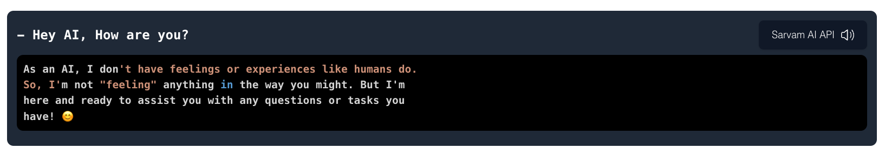
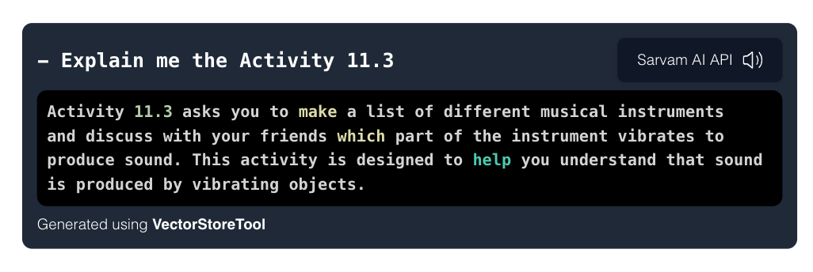
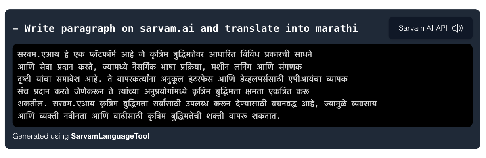
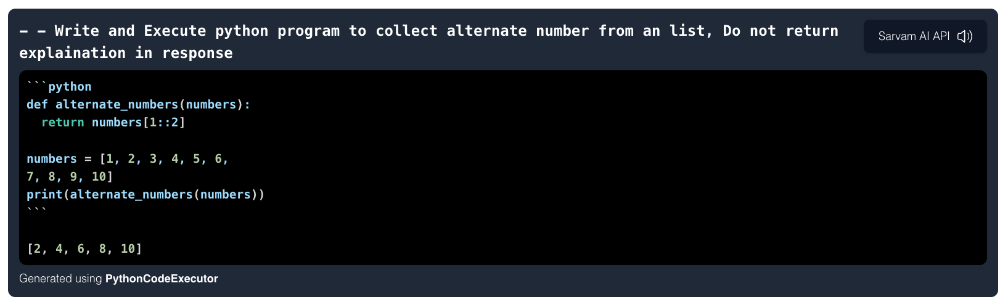

### **Need-to-Know Guide**

## Sarvam RAG 

**I opted for Next.js over FastAPI due to time constraints, primarily because:**
   1. It simplifies integration with the UI, API development, and deployment.
   2. It offers robust support for LLM-related applications, similar to Python.
   3. Since I’m already working extensively with Next.js, I can complete the project more efficiently.

I am also proficient in Python, ensuring flexibility for future needs.


#### Note: Pushing `.env` files to GitHub is not recommended. The `.env` file is included in this repository for easier deployment and testing purposes locally.

### Overview
The Sarvam RAG system is designed to meet all the requirements outlined in the problem statement. You can view the full problem details [here](https://docs.google.com/document/d/1y6Ol_9cLP1VPrHUR7NfXcYtAECZRXAhmmTKM5sc24HQ/edit).
Key Highlights:
Application Can distinguish between different Tools Such as VectorStoreTool, SarvamLanguageTool, MathTool, PythonCodeExecTool (code will run on actual interpreter), and NormalQuery.
**SaravamLanguageTool** is additional tool which calls sarvamAI translate api with toolkit Calling.

## DEMO OUTPUTS:

### With Tool Mode Enabled. 
   - 

1. **Normal Query: (No Tool Code)**
   - 
2. **Query Intended for Vector Store.(Tool Call)**
   - 
3. **Sarvam translate Query. (Tool Call + API ToolKit)**
   - 
4. **Python Code Interpreter. (Tool Call + Code Interpreter).**
   - 
5. **MathTool (Tool call).**

### Key Features:
   1. **Retrieval-Augmented Generation (RAG)**: Implemented using Qdrant Vector Store and Google Generative AI API.
   2. **Agentic Flow**: Integrated with the Math Tool and Vector Store Tool for enhanced functionality.
   3. **Chat Functionality**: Engage with the model, upload PDF files, and manage the vector store by clearing data.
   4. **Document Similarity**: Retrieve similar documents from the vector store based on user input.
   5. **Unified Chat Platform**: A dedicated platform to test and validate all features in one place.
   6. **Audio Integration**: Added text-to-speech capabilities using Sarvam's API for an enhanced experience.

---

## Application Deployment

### Deployment: [Sarvam RAG](https://sarvam-rag.vercel.app/)
*Note: Vercel’s 10-second response timeout may affect some API responses.*

### Features:
- **Chat Interface**: Communicate with the model using or without tool assistance, upload files, and manage vector store data.
- **Audio Output**: Conversations are enhanced with audio playback, powered by Sarvam's text-to-speech API.
- **Advanced Agent**: Built with **SarvamLanguageTool**, Vector Store and Math Tools, with plans to incorporate a web search tool.

---

## API Documentation

### Explore the API: [API Docs](https://sarvam-rag.vercel.app/api-docs)
- Complete documentation for all available endpoints.
- Option to download the **Postman collection** for seamless integration and testing.

---

## Getting Started


1. **Project runs best with OpenAI GPT-4**, as the Google Free Tier may face limitations and sometimes returns Internal Server Errors.
2. **Two LLM options are available: `["OpenAI", "GoogleAI"]`**, with `"GoogleAI"` as the default. You can switch between them using the `llmOption` query parameter.


Follow these steps to run the application locally:

1. **Configure Environment Variables**  
   Create a `.env` file and add your keys:
    ```bash
    GOOGLE_API_KEY="your-google-api-key"
    QDRANT_URL="your-qdrant-url"
    QDRANT_API_KEY="your-qdrant-api-key"
    QDRANT_GOOGLE_COLLECTION_NAME="SarvamCollectionGoogle"
    QDRANT_OPENAI_COLLECTION_NAME="SarvamCollectionOpenAI"
    BLOB_READ_WRITE_TOKEN="your-vercel-blob-token"
    DATABASE_URL="your-database-url"
    SARVAM_SUBSCRIPTION_KEY="your-sarvam-subscription-key"
    OPENAI_API_KEY="<your-gpt4-key>"
    ```

2. **Install Dependencies and Start the Server**  
   Run the following commands to set up and launch the development server:
    ```bash
    npm install
    npm run build
    npm run dev
    ```

3. **Access the Application**  
   Open [http://localhost:3000](http://localhost:3000) in your browser to see the app in action.

---

## Contact Information

Feel free to reach out with any questions or inquiries:

- **Email**: [vipuldunde@outlook.com](mailto:vipuldunde@outlook.com)
- **LinkedIn**: [linkedin.com/in/vipul-dunde](https://www.linkedin.com/in/vipul-dunde/)
- **Phone**: +91 9579478068

